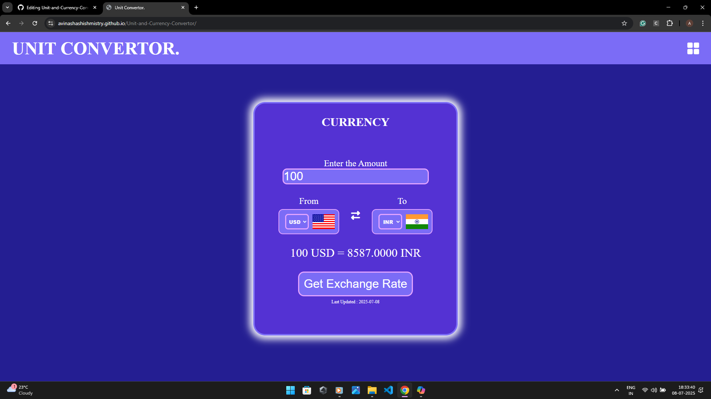
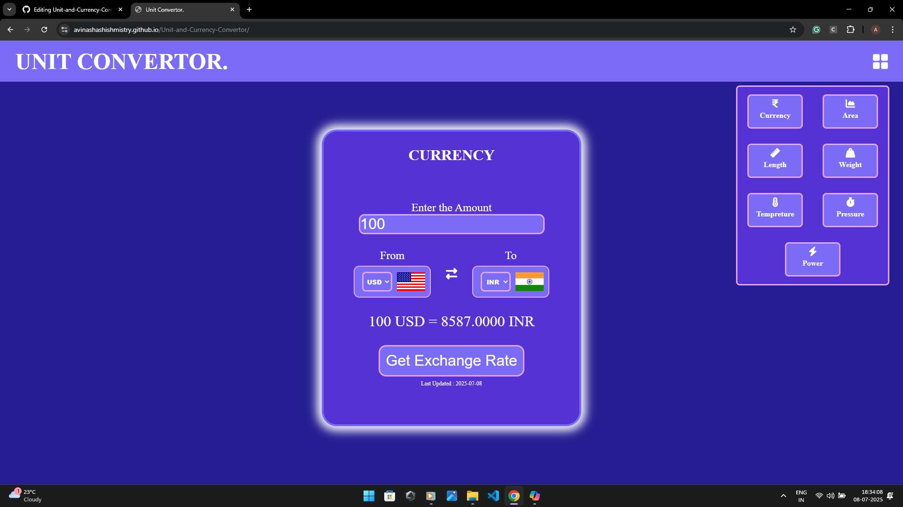
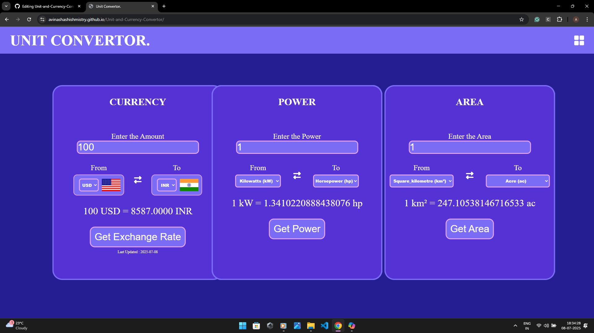
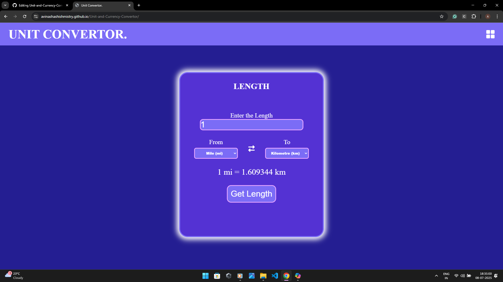

# 🌐 Unit & Currency Converter Web App

A clean and responsive web application for converting **units** (length, area, weight, temperature, pressure, volume) and **currencies** in real time. Built with HTML, CSS, and JavaScript, and powered by the **ExchangeRate API**, this tool simplifies everyday conversions with speed and accuracy.

---

## 🚀 Features

- 🔁 **Unit Conversion**: Convert between metric and imperial units for:
  - 📏 Length
  - 📐 Area
  - ⚖️ Weight
  - 🌡️ Temperature
  - 💨 Pressure
  - 🧪 Volume

- 💱 **Currency Converter**:
  - Real-time exchange rate fetching via [ExchangeRate API](https://exchangerate.host)
  - Supports dozens of global currencies with auto-updated rates

- 🎨 **Responsive UI**:
  - Mobile-friendly layout
  - Minimal, user-focused design

---

## 🛠 Tech Stack

| Layer        | Technology           |
|----------------- |-------------------------------------------------------------------- |
| 💻 Frontend     | HTML5, CSS3, JavaScript                                             |
| 📦 Unit Logic   | `convert.js` (custom script for unit conversion)                    |
| 🌐 Currency API | [ExchangeRate API](https://exchangerate.host) for real-time rates   |


---

## 🧪 How to Use

1. Clone or download the repository:
   ```bash
   git clone https://github.com/AvinashAshishMistry/unit-currency-converter.git
   ```
## 🌟 Customization Ideas

- 🌍 **Language Switch (i18n)**: Add multilingual support with a language dropdown.
- 💡 **Accessibility & Dark Mode**: Improve keyboard navigation and add a dark theme toggle.
- 📊 **Currency Trend Visualization**: Show recent currency trends with simple charts or graphs.
- 💾 **Conversion History**: Let users bookmark or revisit recent and favorite conversions.

---

## 🙌 Credits

- Currency data provided by the fantastic [ExchangeRate API](https://exchangerate.host)
- Created with a love for clean design and practical utility 💙


🔗 [Run the App in Browser](https://avinashashishmistry.github.io/Unit-and-Currency-Convertor/)






---

### 💬**Contribution Guidelines**
If it’s open-source, invite others to contribute:

```markdown
🤝 Contributing

Contributions are welcome!
Feel free to fork the repo and submit a pull request with improvements or new features.
```
